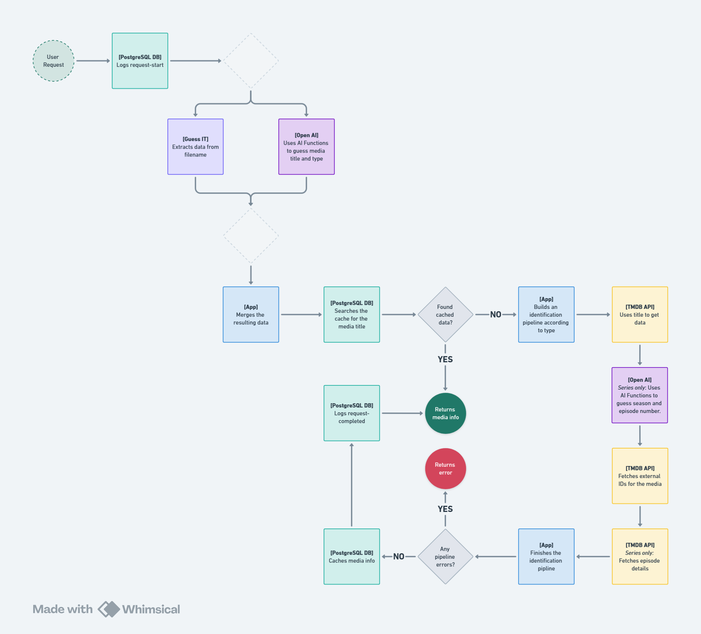

# Media Identifier API

A RESTFUL API that identifies the media based on the filename. 

This project was created for educational purposes, showing how to:
1. Making different platforms work in tandem.
2. Applying caching to the system. (In this case, we don't need to worry about stale data, but still.)
3. How to use AI functions to get deterministic responses.

While I understand that an increasing number of poeple consider that 'if buying is not owning, pirating is not stealing,'
this API is not processing files, but working only with the filenames. You can create any scene-release filenames and 
test it as you like.
> TL;DR: Educational purposes, not condoning anything illegal. You do whatever you want at your own risk.

## Request flow


The happy path for identifying the media is:
- We try to guess data using GuessIT
- If we have the data cached, we return that;
- Otherwise, we use TMDB to identify it.
- If that fails, we use some AI Functions with OpenAI to identify the media.
- Then we call TMDB again to get details for the media;
- And again to get the external IDs (like IMDB id, etc.)
- Lastly, we cache this info, so we don't have to do the work twice.
- And return the data to the user.


## Endpoints

The application is built with FastAPI and exposes the GuessIt library's functionality through a RESTful API. It provides three main endpoints:

- `/api/guess` - Analyzes a filename and returns structured information
- `/api/health` - Provides a health check to verify the API is functioning correctly
- `/api/statistics` - Returns statistics about requests made to the API

## Installation and Usage

### Environment variables
To use this, you must set a handful of environment variables:
```dotenv
POSTGRES_HOST=localhost
POSTGRES_PORT=5432
POSTGRES_USER=postgres
POSTGRES_PASSWORD=P4ssword!
TMDB_API_KEY=your-tmdb-api-key
OPENAI_API_KEY=your-open-ai-key
OPENAI_MODEL=gpt-4o-mini # I recommend this model, but you can use any other you like.
OPENAI_ORGANIZATION=your-organization-key
```

### Local Installation

#### Prerequisites
- Python 3.11 or higher

#### Using Virtual Environment (recommended)

```bash
# Clone the repository
git clone https://github.com/brenordv/media-identifier-api.git
cd media-identifier-api

# Create a virtual environment
python -m venv venv

# Activate the virtual environment
# On Windows:
venv\Scripts\activate
# On macOS/Linux:
source venv/bin/activate

# Install dependencies
pip install -r requirements.txt

# Run the application
python main.py
```

The API will be available at http://localhost:8000

#### Without Virtual Environment

```bash
# Clone the repository
git clone https://github.com/brenordv/media-identifier-api.git
cd media-identifier-api

# Install dependencies
pip install -r requirements.txt

# Run the application
python main.py
```

### Using Docker

#### Building the Docker Image

```bash
# On Linux/macOS:
./build-image.sh

# On Windows (PowerShell):
docker build -t guessit-api:latest .
```

#### Running the Docker Container

```bash
# On Linux/macOS:
./run-image.sh

# On Windows (PowerShell):
docker run -d --name guessit-api -p 10147:10147 --restart unless-stopped guessit-api:latest
```

The API will be available at http://localhost:10147

## API Usage Examples

### Analyzing a Movie Filename

```
GET /api/guess?it=Shin%20Godzilla%20(2016)%201080p%20Hybrid%20Bluray%20REMUX%20AVC%20Dual%20DTS-HD%20MA%203.1
```

Response:
```json
{
  "title": "Shin Godzilla",
  "year": 2016,
  "screen_size": "1080p",
  "source": "Blu-ray",
  "other": "Hybrid, Remux",
  "video_codec": "H.264",
  "audio_channels": "3.1",
  "audio_codec": "DTS-HD"
}
```

### Analyzing a TV Show Filename

```
GET /api/guess?it=Rick.and.Morty.S07E10.Fear.No.Mort.1080p.HMAX.WEB-DL.DDP5.1.H.264-FLUX.mkv
```

Response:
```json
{
  "title": "Rick and Morty",
  "season": 7,
  "episode": 10,
  "episode_title": "Fear No Mort",
  "screen_size": "1080p",
  "streaming_service": "HBO Max",
  "source": "Web",
  "audio_codec": "Dolby Digital Plus",
  "audio_channels": "5.1",
  "video_codec": "H.264",
  "release_group": "FLUX",
  "container": "mkv"
}
```

### Health Check

```
GET /api/health
```

Response:
```json
{
  "message": "healthy"
}
```

### Statistics

```
GET /api/statistics?num_requests=5
```

Response:
```json
[
  {
    "id": "2577e39f-6ca8-4450-adae-f6395efc4862",
    "filename": "Death.Proof.2007.1080p.BluRay.x264-1920/1920-proof.rar",
    "requester_ip": "127.0.0.1",
    "result_status": 200,
    "result_media_id": "ed6822d6-e603-4dc9-8556-1a5289a950a7",
    "received_at": "2025-08-04T16:16:08.844097",
    "responded_at": "2025-08-04T16:16:42.564877",
    "elapsed_time": 1.02078,
    "error_message": null
  }
]
```

## More Examples

See the [example_requests.http](example_requests.http) file for more usage examples.

## Dependencies

This project relies on:
- [GuessIt](https://github.com/guessit-io/guessit) - The core library for parsing filenames
- [FastAPI](https://fastapi.tiangolo.com/) - Modern, fast web framework for building APIs
- [Uvicorn](https://www.uvicorn.org/) - ASGI server for running the application
- [Requests](https://requests.readthedocs.io/) - HTTP library for testing
- [psycopg2](https://pypi.org/project/psycopg2/) - Library to interact with PostgresSQL database
- [python-dotenv](https://pypi.org/project/python-dotenv/) - Library to handle `.env` files
- [simple-log-factory](https://pypi.org/project/simple-log-factory/) - Helper lib to facilitate the use of the native Python logging (Shameless plug: I made this. 😁)
- [openai](https://pypi.org/project/openai/) - Official OpenAI SDK.

## License

This project is licensed under the [GNU Lesser General Public License v3 (LGPLv3)](https://www.gnu.org/licenses/lgpl-3.0.html), the same license as the GuessIt library.

## Acknowledgements

This project is a simple wrapper around the excellent [GuessIt](https://github.com/guessit-io/guessit) library. 
All the hard work of parsing and analyzing filenames is done by GuessIt, and that project is absolutely awesome! So go 
check it out! :D 

We also heavily rely on the [TMDb API](https://developer.themoviedb.org/reference/intro/getting-started). 
It is hard to believe that their API have a free tier.